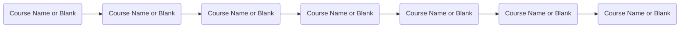

# Course Name
[Course Description]

## Collaborators
- **Senior Learning Experience Designer**: First Last (first.last@wgu.edu)
- **LXD manager**: First Last (first.last@wgu.edu)
- **Program Development Owner**: First Last (first.last@wgu.edu)
- **Program Chair (or LAPM)**: First Last (first.last@wgu.edu)
- **Educational Product Designer**: First Last (first.last@wgu.edu)

## Part I: Course Overview
### Standard Path

### Vision & Scope
### Competencies & Assessment
### Certifications, Frameworks, and Taxonomies
### Learning Approach/Design Patterns
### Primary Learning Resources

## Part II: Course Sections
### Section 1: Title
### Section 1 Assessment Notes
### Section 2: Title
### Section 2 Assessment Notes

## Part III: Course Development and Build
### Step 1: Course Development Preparation
### Step 2: Course Build Documentation

